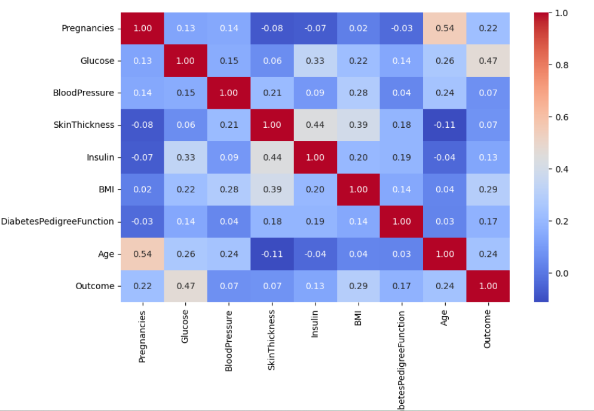

# Laporan Proyek Machine Learning - Andreas Kevin


Pada era teknologi digital, tenologi machine learning menjadi teknologi utama dalam pengolahan dan analisis data. Machine learning membantu dalam banyak kasus. Penerapan machine learning saat bermacam, seperti kasus klasifiksi. Klasifikasi memungkinkan sistem untuk mengkategorikan berdasarkan pola yang telah dipelajari dari data.

Pengembangan klasifikasi dalam machine learning telah memberikan manfaat dlam berbagai bidang seperti kesehatan, sentimen analisis, spam pada email, keuangan, hingga dalam skala industri global. 

Proyek ini memiliki tujuan untuk pengembangan model klasifikasi dalam membantu dalam melakukan diagnosa penderita diabetes berdasarkan data yang telah diperoleh. Fokus utama pengembangan model machine learning ini tidak hanya pada perfoma yang tinggi tetapi diharapkan dapat diterapkan menjadi alat bantu bidang kesehatan.

Pada proyek yang dirancang, proses didasari pada pemaparan masalah dan fokus penyelesaian atas masalah tersebut. Proses tersebut melibatkan pemrosesan data, analsisi data, persiapan data, perancangan model, hingga tahap akhir evaluasi model. 

Proyek ini menjadi fokus sebagai hal yang penting diselesaikan karena diabetes menjadi satu dari beberapa penyakit kronis yang perlu deteksi dini dalam mencegah komplikasi penyakit yang lebih lanjut. Dengan adanya model klasifikasi yang akurat, tenaga metis dapat terbantu dalam membuat keputusan yang lebih cepat dalam pencegahan atapun pengobatan pasien. 
  Penelitian ini semakin penting dilakukan dengan didasari pada:
  - [Kejadian Diabetes Melitus Tipe I pada Usia 10-30 Tahun](https://journal.unnes.ac.id/sju/higeia/article/view/31763), memaparkan bahwa angka penyakit diabetes melitus yang tinggi pada Jepara sehingga perlu diketahui faktor yang berhubungan dengan penyakit diabetes.
  - [Deteksi Dini Penyakit Diabetes MelituS](https://ejournal.uksw.edu/jms/article/download/5891/2047/26847), penelitian tersebut menyampaikan pentingnya deteksi dini atas penyakit diabets melitus.
  - [Analisa Tingkat Pengetahuan Masyarakat tentang Penyakit Diabetes Mellitus di RW 004 Kelurahan Pulogebang Kecamatan Cakung Jakarta Tim](https://journal.uin-alauddin.ac.id/index.php/psb/article/download/24229/12535), menyampaikan pentingnya pengetahuan atas penyakit diabetes melitus di kalangan masyarakat.

  Beberapa penyelitian sebelumnya terkait dengan diagnosis penyakit diabetes menggunakan teknik machine learning tersebut berupa:
  - [Analisis Penggunaan Support Vector Machine pada Deteksi Dini Penyakit Diabetes Melitus](https://jurnal-id.com/index.php/jupin/article/view/643), pada penelitian tersebut disampaikan efektifitas algoritma SVM dalam mendeteksi diabetes yang mencapai akurasi 81%.
  - [Penerapan Model Machine Learning untuk Deteksi Dini dan Klasifikasi Akurat Diabetes Tipe 2](https://pmc.ncbi.nlm.nih.gov/articles/PMC10378239/), penelitian tersebut menghasilkan metode K-NN menjadi solusi atas deteksi iabetes tipe 2 terbaik.
  - [Pendekatan Data Science untuk Deteksi Dini Diabetes Menggunakan Naive Bayes Classifier](https://jurnal.stts.edu/index.php/insight/article/view/300/160), penelitian tersebut menggunakan naive bayes dalam melkaukan deteksi diabets dengan capaian akurasi 70%.

---
### ⚠️ Problem Statements
Adapun yang menjadi dasar masalah dalam penelitian ini berupa:
- Dari atribut yang telah dimunculkan, faktor apa yang memberikan pengaruh signifikan atas penentuan seseorang menderita diabetes?
- Bagaimana analisis untuk mengetahui seseorang menderita diabetes atau tidak?

---
### ✨ Goals
Berdasarkan problem statements yang telah dipaparkan penulis, adapun yang menjadi tujuan dalam penelitian ini yaitu:
- Menentukan faktor sifnifikan yang palinig berkolerasi dalam seseorang mengidap diabetes.
- Membuat model machine learning yang dapat memprediksi pengidap diabetes seakurat mungkin berdasarkan fitur-fitur yang ada.

---
### 💡 Solution Approach
Dalam menyelesaikan permasalahan yang telah diidentifikasi tersebut, penelitian ini menerapkan pendekatan berbasis machine learning dengan memanfaatkan algoritma klasifikasi dalam mendeteksi diabetes. Penelitian dilakukan dengan menggunakan algoritma machine learning yaitu Regresi Logistik dan Multi Layer Perceptron. Dalam meningkatkan pembelajaran yang lebih baik, penelitian dilkaukan dengan beberapa proses yang meliputi pengolahan data, eksplorasi fitur, pemilihan model, hingga evaluasi performa untuk memastikan akurasi yang optimal dalam prediksi diabetes.

## 📑 Data Understanding
Dataset merupakan kumpulan data yang teorganisir. Pada diagnosis diabetes, dataset berisikan informsi medis yang berkaitan dengan diabetes. Dataset yang diperoleh berasal dari observasi oleh Natioanal Institute of Diabetes and Digestive and Kidney Disaeses yang terdiri dari 769 data dengan 9 variabel atribut. [Diabetes Dataset](https://www.kaggle.com/datasets/mathchi/diabetes-data-set).

### Variabel-variabel yang terdapat pada dataset tersebut yaitu:
- **Pregnancies**: Jumlah kehamilan yang pernah dialami pasien.
- **Glucose**: Konsentrasi glukosa plasma setelah 2 jam dalam tes toleransi glukosa oral.
- **BloodPressure**: Tekanan darah diastolik dalam satuan mmHg.
- **SkinThickness**: Ketebalan lipatan kulit triseps dalam mm.
- **Insulin**: Kadar insulin serum setelah 2 jam (mu U/ml).
- **BMI (Body Mass Index)**: Indeks massa tubuh yang dihitung sebagai berat (kg) / tinggi (m²).
- **DiabetesPedigreeFunction**: Skor yang menunjukkan kemungkinan seseorang terkena diabetes berdasarkan riwayat keluarga.
- **Age**: Usia pasien dalam tahun.
- **Outcome**: Target kelas (0 = tidak diabetes, 1 = diabetes). Model akan mencoba memprediksi apakah seseorang menderita diabetes atau tidak berdasarkan fitur lainnya.

---
### Proses analisis data
Proses pengumpulan data yang telah dilkaukan kemudian dilakukan analisis atas data teresebut. Analisis terebut dilkukan untuk memahami konidisi isi atas data tersebut. Beberapa teknik analisis yang dilakukan berupa: 
- **".info()"** = ini dilakukan untuk mengetahui jumlah data, dan tipe data. Proses ini dilakukan untuk memahami tipe data yang telah benar.
- **".isnull().sum()"** = dilakukan untuk melihat total data yang kosong.
- **".duplicated().sum()"** = dilakukan untuk melihat total data yang duplikasi. 
- **".describe()"** = dilakukan untuk melihat info statistik pada data tersebut, ini berguna untuk melihat penyebaran data dalam identifiksi outlier.
- **Penentuan outlier**:
  - Berdasarkan q25 dan q75 (Q1 dan Q3) dengan metode **Interquartile Range (IQR)**.
  - Setelah itu dilakukan penghapusan atas data outlier tersebut. Tujuan dari penghapusan ini agar model dapat belajar dengan baik dari data yang bersih dari outlier.

---
### Visualisasi Data
Beberapa teknik visualisasi digunakan untuk memahami hubungan antar variabel, distribusi data, dan deteksi anomali, antara lain:
- **Boxplot**: Digunakan untuk melihat rentang penyebaran data serta mengidentifikasi outlier.

- **Heatmap**: Membantu dalam memahami korelasi antar variabel dalam dataset.

- **Histogram**: Digunakan untuk melihat distribusi frekuensi data dalam tiap variabel.


## 🛠️ Data Preparation
Data preparation merupakan proses penyiapan data agar dapat diproses lebih lanjut (sebelum dilakukan pelatihan atas model). Pada kasus ini, proses data preparation dapat diuraikan menjadi:
### 1. Drop Outlier Data
Drop outlier data, yang merupakan proses membuang data outlier yang telah ditentukan berdasarkan 25% dan 75%. 
```python
def kolomoutlier(df):
    outlier_columns = []
    for col in df.select_dtypes(include=[np.number]).columns:
        q25, q75 = np.percentile(df[col], 25), np.percentile(df[col], 75)
        iqr = q75 - q25
        cut_off = iqr * 1.5
        minimum, maximum = q25 - cut_off, q75 + cut_off

        outliers = df[(df[col] < minimum) | (df[col] > maximum)]
        if not outliers.empty:  # Jika ada outlier, tambahkan ke list
            outlier_columns.append(col)
    
    return outlier_columns
def remove_outliers(df, columns):
    df_clean = df.copy()
    for col in columns:
        q25, q75 = np.percentile(df_clean[col], 25), np.percentile(df_clean[col], 75)
        iqr = q75 - q25
        cut_off = iqr * 1.5
        minimum, maximum = q25 - cut_off, q75 + cut_off

        df_clean = df_clean[(df_clean[col] >= minimum) & (df_clean[col] <= maximum)]
    
    return df_clean
```
Pada proses yang ditampilkan diatas merupakan proses dalam drop outlier, yang pada proses tersebut hasil data yang sudah bersih ditampung dalam df_clean.

---
### 2. Normalisasi Data dengan Min-Max Scaling
Normalisasi data yang dilakukan adalah normalisasi data min-max. 
```python
scaler = MinMaxScaler()
df_diabetes_scaled = scaler.fit_transform(df_diabetes)

df_diabetes = pd.DataFrame(df_diabetes_scaled, columns=df_diabetes.columns)
```
Normalisasi ini mengubah data menjadi rentang 0-1. Tujuan dari normalisasi ini untuk mencegah dominasi fitur dengan skala yang besar (contoh: glukasi memiliki fitur dengan skala yang lebih besar) dan mempercepat konvergensi model. Selain itu, normalisasi ini dipilih dikarenakan distribusi data yang terlihat tidak normal sehingga teknik MinMaxScaler akan lebih sesuai atas kasus ini.

---
### 3. Pemisahan Fitur (X) dan Target (y)
Membagi menjadi X sebagai input dan y sebagai output. Tujuan dari pembagian ini adalah agar data dapat belajar dari x dan y sebagai tujuan. 
```python
X = df_diabetes.drop(['Outcome'], axis=1)
y = df_diabetes['Outcome']
```
Pada proses yang dipaparkan tersebut, data X dilakukan dengan membuang atribut "outcome" pada df_diabetes, dan y dilakukan dengan menggunakan atribut "outcome".

---
### 4. Pembagian Data untuk Machine Learning
```python
X_train_MLP, X_test_MLP, y_train_MLP, y_test_MLP = train_test_split(X, y, test_size=0.2)
X_train_LG, X_test_LG, y_train_LG, y_test_LG = train_test_split(X, y, test_size=0.2)
```
Pembagian model dilakukan secara 2 kali yaitu pembagian untuk MLP dan pembagian untuk logistic regression. Pembagian dilkaukan dengan membagi data menjadi 80% sebagai training dan 20% sebagai testing. 


## 🤖 Modeling
Proses modeling memuat proses perancangan model yang digunakan dalam teknik klasifikasi. Proses modeling ini melihatkan grid search dalam menentukan parameter terbaik. 

---
### Logistic Regression
Logistic regression yang dibagun menggunakan library sklearn. Parameter yang ikut disertakan dalam pembagunan model ini berupa:
- **random_state**: yang merupakan titik awal.
- **max_iter**: merupakan maksimal iterasi yang dilakukan.
Parameter lain digunakan gridsearch untuk membantu mengtahui nilai terbaik dari parameter tersebut:
- **C**: parameter regulasi yang mengontrol kekuatan regularisasi.
- **penalty**: jenis regularisasi yang diterapkan (misalnya, l1, l2).
- **solver**: digunakan untuk mengoptimalkan fungsi logistik (liblinear, lbfgs).

```python
grid_search = GridSearchCV(LG, param_grid, cv=5, n_jobs=-1, verbose=2)
grid_search.fit(X_train_LG, y_train_LG)
```
Pencarian model terbaik dilakukan dengan teknik grid search dan kemudian melatih model dengan parameter terbaik.

---
### Multi Layer Perceptron
MLP dibangun menggunakan library sklearn. Parameter yang disertakan dalam model ini berupa:
- **random_state**: yang merupakan titik awal.
- **max_iter**: merupakan maksimal iterasi yang dilakukan.
- **solver**: merupakan teknik mengoptimalkan (optimizer).
Parameter lain digunakan gridsearch untuk membantu mengtahui nilai terbaik dari parameter tersebut:
- **hidden_layer_sizes**: merupakan jumlah dan banyak hidden layer.
- **activation**: merupakan fungsi aktivasi. (relu (merupakan fungsi yang umum digunakan biasanya di deep learning) dan logistic (digunakan untuk hasil ouput pada kasus dengan output biner yaitu 0 dan 1)).
- **alpha**: mengontrol regulasi terutama dalam menghindari overfitting.
- **learning_rate**: engatur kecepatan belajar, yang digunakan berupa constant (nilai yang tetap sama selama training) dan adaptive (menyesuaikan nilai learning rate selama training berdsarkan loss yang diperoleh).

---
### Kelebihan dan kekurangan Logistic Regression dan MLP
#### Logistic Regression
**Kelebihan:**
- **Mudah Dipahami dan Diterapkan**: Model ini memiliki konsep yang sederhana dan dapat diimplementasikan dengan mudah.
- **Proses Pelatihan Cepat**: Logistic Regression memiliki waktu pelatihan yang relatif singkat, terutama untuk dataset berukuran kecil hingga menengah.
- **Jumlah Parameter yang Sedikit**: Model ini tidak memerlukan banyak parameter yang kompleks untuk dikonfigurasi.
- **Efisien dalam Penggunaan Sumber Daya**: Tidak memerlukan komputasi yang tinggi dibandingkan model lain yang lebih kompleks.

**Kekurangan:**
- **Kurang Fleksibel dalam Menangani Data yang Kompleks**: Model ini tidak efektif jika data tidak dapat dipisahkan secara linear.
- **Sensitif terhadap Outlier**: Adanya outlier dalam dataset dapat mempengaruhi hasil prediksi secara signifikan.
- **Kurang Optimal untuk Data Berdimensi Tinggi**: Jika jumlah fitur sangat banyak, performa model dapat menurun tanpa adanya teknik reduksi dimensi.

#### Multi Layer Perceptron (MLP)
**Kelebihan:**
- **Mampu Menangani Hubungan Non-Linear**: Model ini dapat mengenali pola yang lebih kompleks dibanding Logistic Regression.
- **Fleksibel untuk Berbagai Jenis Kasus**: MLP dapat digunakan untuk klasifikasi maupun regresi pada berbagai bidang.
- **Kemampuan Generalisasi yang Baik**: Dengan jumlah data yang cukup, model ini dapat memberikan prediksi yang lebih akurat.
- **Dapat Menggunakan Berbagai Fungsi Aktivasi**: MLP mendukung penggunaan fungsi aktivasi seperti ReLU dan sigmoid yang disesuaikan dengan kebutuhan.

**Kekurangan:**
- **Memerlukan Dataset yang Lebih Besar**: Untuk mendapatkan performa yang baik, model ini membutuhkan jumlah data yang lebih banyak dibanding Logistic Regression.
- **Proses Pelatihan yang Lebih Lama**: MLP memiliki proses pelatihan yang lebih kompleks dan memerlukan lebih banyak waktu.
- **Sulit untuk Diinterpretasikan**: Model ini bekerja sebagai "black box", sehingga sulit untuk memahami bagaimana keputusan dibuat.
- **Rentan terhadap Overfitting**: Jika tidak dilakukan regulasi yang tepat, model dapat terlalu menyesuaikan data latih dan kurang mampu melakukan generalisasi dengan baik.


## 🔍 Evaluation
Pada proses evaluasi menggunakan confusion matriks dan MAE. 
```python
akurasi_LG = met.accuracy_score(y_test_LG, y_pred_LG)
f1score_LG = met.f1_score(y_test_LG, y_pred_LG, average='weighted')
precision_LG = met.precision_score(y_test_LG, y_pred_LG, average='weighted')
recall_LG = met.recall_score(y_test_LG, y_pred_LG, average='weighted')
cm_LG = met.confusion_matrix(y_test_LG, y_pred_LG)

akurasi_MLP = met.accuracy_score(y_test_MLP, y_pred_MLP)
f1score_MLP = met.f1_score(y_test_MLP, y_pred_MLP, average='weighted')
precision_MLP = met.precision_score(y_test_MLP, y_pred_MLP, average='weighted')
recall_MLP = met.recall_score(y_test_MLP, y_pred_MLP, average='weighted')
cm_MLP = met.confusion_matrix(y_test_MLP, y_pred_MLP)
```
Proses diatas merupakan proses menghitung akurasi, f1-score, precision, dan recall, serta memunculkan dalam visualisasi confusion matriks.

- **Akurasi (Accuracy)**: Mengukur sejauh mana model dapat mengklasifikasikan data dengan benar. Dihitung sebagai rasio antara jumlah prediksi yang benar dengan total keseluruhan data.
- **F1-Score**: Merupakan ukuran keseimbangan antara precision dan recall. Nilai F1-score tinggi menunjukkan bahwa model memiliki performa yang baik dalam mengklasifikasikan data positif maupun negatif.
- **Precision**: Mengukur proporsi prediksi positif yang benar dibandingkan dengan total prediksi positif yang dibuat oleh model.
- **Recall (Sensitivity)**: Mengukur sejauh mana model mampu menemukan semua data yang termasuk dalam kelas positif.
- **Confusion Matrix**: Matriks yang menunjukkan jumlah prediksi benar dan salah untuk setiap kelas. Berguna dalam memahami bagaimana model melakukan kesalahan klasifikasi.

selain itu percobaan menggunakan MAE dalam mengukur kinerja:
- **MAE**: Mengukur hasil selisih prediksi dan aktual.


Akan tetapi hasil evaluasi MAE tidak cocok dan tidak disarankan dalam kasus ini dikarenakan hasil prediksi yang berupa nilai diskrit (0/1) sedangkan nilai MAE menilai selisih hasil prediksi dan aktual yang akan lebih cocok pada kasus yang tidak dalam diskrit.

---
### Visualisasi confusion matriks Logistic Regression


---
### Visualisasi confusion matriks Multi Layer Perceptron (MLP)


## 🎯 Kesimpulan
- Berdasarkan kolerasi **glukosa** dan **BMI** memberikan pengaruh yang cukup kuat atas diagnosis penderita mengalami diabetes.
- Algoritma Logistic Regression memiliki kemampuan lebih unggul yang mencapai tingkat akurasi 83% dibandingkan Multi Layer Perceptron yang mencapai 78%.
- Berdasarkan dasar akurasi model dalam industri, kedua model tersebut dapat digunakan dalam dunia industri karena dianggap model tersebut sudah cukup mampu dalam melakukan klasifikasi.

